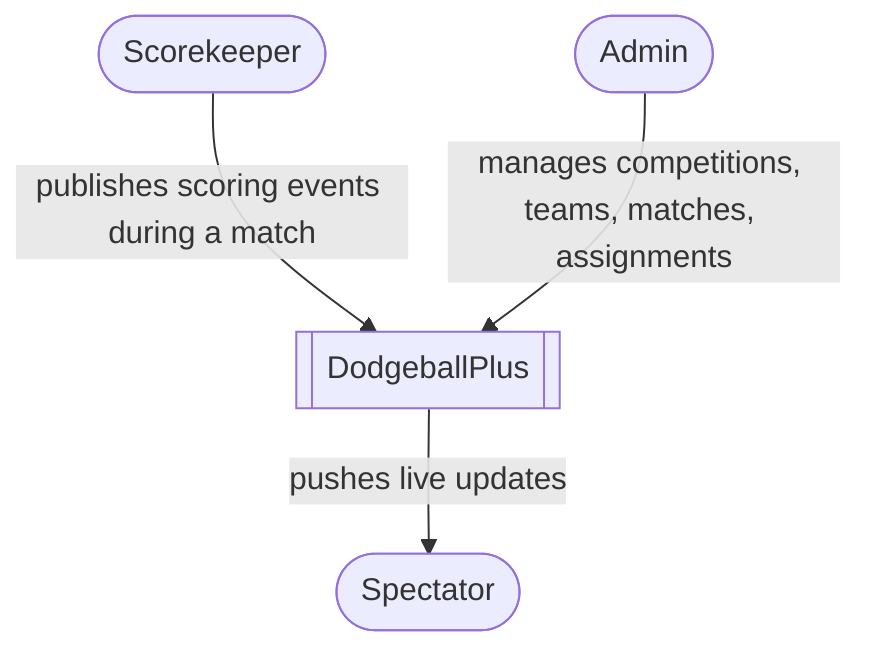
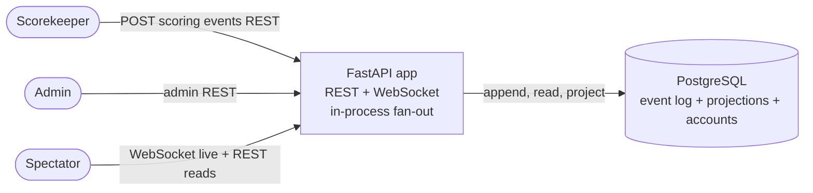
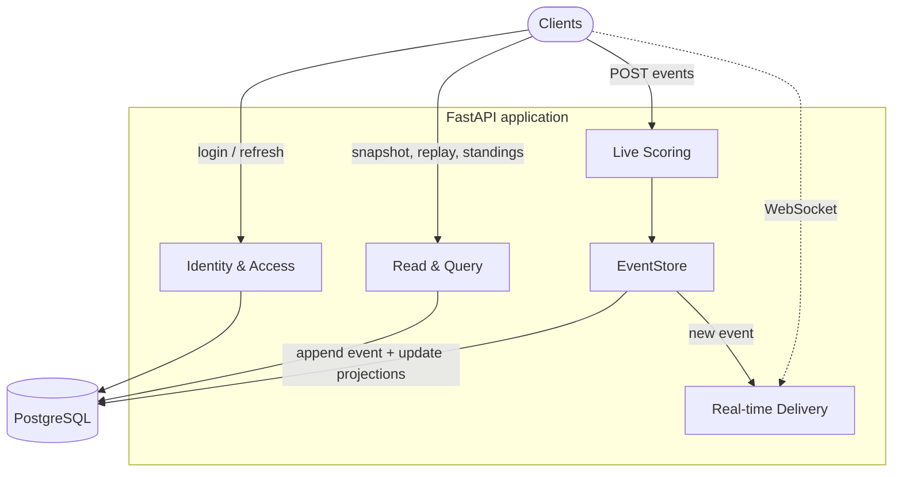
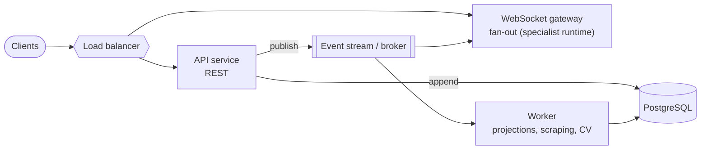

# C4 Diagrams

A C4 view of the system at increasing zoom: context, containers, and components,
plus a labelled future-state diagram. This is the visual companion to
[overview.md](../overview.md) §4.

## Level 1 — System Context

Who uses the system and why.

The scorekeeper writes, the admin sets things up, and spectators read. There are no
external systems in v1.0 — historical data sources arrive in v2.0.

## Level 2 — Container

The runtime shape: one application process and one database.

PostgreSQL is the single integration point. Fan-out to spectators happens
in-process inside the one instance (sufficient for the ~5,000-connection target).

## Level 3 — Component

Inside the application, organised by the business areas from overview §2.

The `EventStore` is the only path to the event log: `Live Scoring` appends through
it, it updates the projections, and it hands the new event to `Real-time Delivery`
for fan-out. `Read & Query` and `Identity & Access` talk to PostgreSQL directly.

## Future state (not built in v1.0)

The horizontal-scaling shape, shown for context only. Pursued only when measurement
justifies it (`NFR-4`); the WebSocket gateway is where the specialist runtime from
ADR-0009 would slot in.

