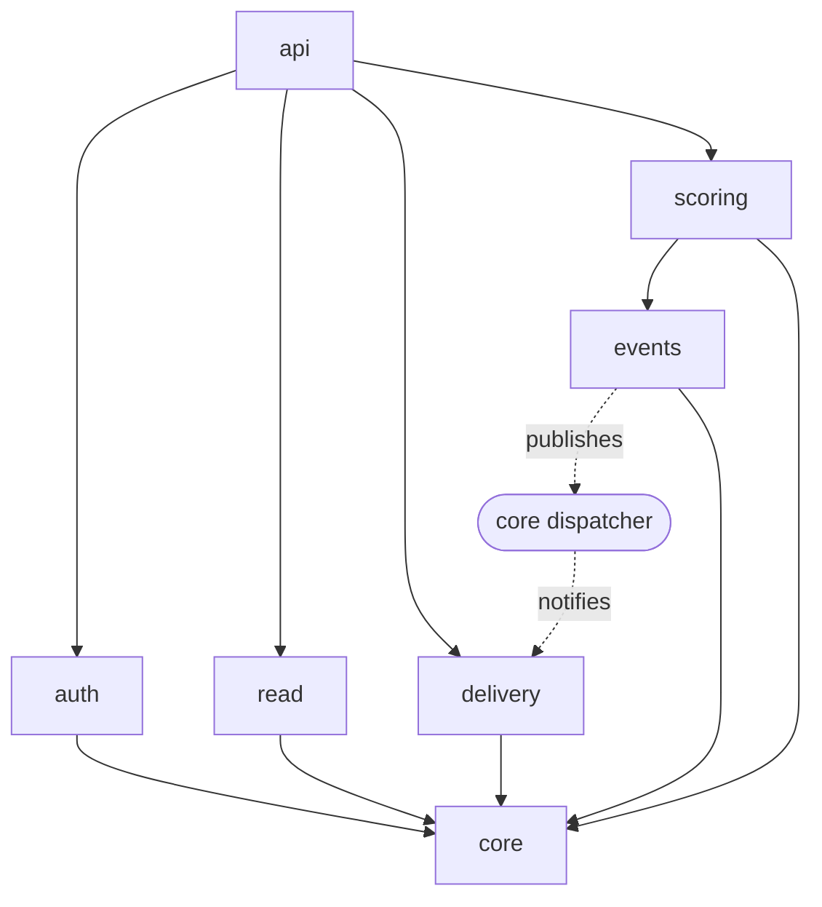

# Module Boundaries

The application is a modular monolith (overview [§4](../overview.md)). This document
fixes the module boundaries — what each owns, who may depend on whom, and how the
rules are enforced — so the structure stays modular and the future service split
(API / WebSocket gateway / worker) is a clean extraction rather than an untangling.

## Modules

Python packages under `app/`:

| Module | Owns | May depend on |
|--------|------|---------------|
| `core` | Config, DB session, shared domain types, the in-process **event dispatcher** | — (nothing internal) |
| `events` | The `EventStore` abstraction + its Postgres implementation — the *only* path to `match_events` | `core` |
| `auth` | Identity & access: registration, tokens, RBAC, scorekeeper assignment | `core` |
| `scoring` | The write path: validate a scoring action and append via `events` | `core`, `events` |
| `delivery` | Real-time: WebSocket connections and fan-out; *consumes* events | `core` |
| `read` | Query / read models: snapshot, replay, standings, listings | `core` |
| `management` | Admin CRUD of reference entities: competitions, teams, matches | `core` |
| `api` | FastAPI routers; the composition root wiring modules to HTTP/WS | all modules |

## Dependency rules



- Everything may depend on `core`; `core` depends on no other internal module.
- `events` is the **sole** accessor of the `match_events` table. No other module
  reads or writes the log directly.
- `scoring` depends on `events`, but **not** on `delivery`. The write path and the
  fan-out path are decoupled through `core`'s dispatcher: `events` publishes a new
  event, and `delivery` subscribes. This decoupling is exactly what lets the
  WebSocket gateway be extracted into its own service later.
- `delivery` and `read` never import the internals of `scoring` or `auth`.
- `api` may depend on every module; nothing depends on `api`.

## Enforcement

Dependency rules are enforced in CI with **`import-linter`** contracts (the Python
counterpart to ArchUnit). Illustrative contracts:

- **`core` is independent** — `core` must not import `auth`, `scoring`, `delivery`,
  `read`, `events`, or `api`.
- **Event log is encapsulated** — only `events` (and `api` wiring) may import the
  `match_events` data access; `read`/`delivery`/`scoring` must go through the
  `EventStore` or projections.
- **Write/fan-out decoupling** — `scoring` must not import `delivery`, and
  `delivery` must not import `scoring`.
- **Layering** — `api` sits on top; no module may import `api`.

These run on every push, so a violating import fails the build rather than eroding
the boundaries silently.

## Package layout

```
app/
├── core/        config, DB session, domain types, event dispatcher
├── events/      EventStore (abstraction + Postgres implementation)
├── auth/        identity & access
├── scoring/     write path (append via events)
├── delivery/    WebSocket connections + fan-out
├── read/        queries / read models
├── management/  admin CRUD of competitions, teams, matches
└── api/         FastAPI routers (composition root)
```
